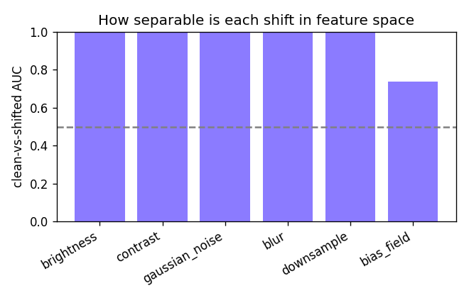

# Auditing a brain-tumour MRI classifier: leakage, domain shift, and reliability

  [](https://github.com/Parth-KG/neuroscan-ood/actions/workflows/tests.yml)

A reported ~99% accuracy on brain-tumour MRI classification sounds impressive, but I wanted to
know whether that number survives an honest evaluation. This project rebuilds a standard
three-class classifier (meningioma, glioma, pituitary) with EfficientNet-B0 and then stress-tests
it: I check for data leakage, verify dataset independence, measure how it behaves under
scanner-style shifts, diagnose why it fails, and try simple, label-free fixes.

Short version: the headline accuracy was inflated, the model is brittle when the scans change, and
the brittleness is largely diagnosable and fixable.

## Contents

- [Key findings](#key-findings)
- [Data](#data)
- [Repository layout](#repository-layout)
- [Setup](#setup)
- [Reproducing the experiments](#reproducing-the-experiments)
- [Limitations](#limitations)
- [Citation](#citation)
- [Contact](#contact)
- [License](#license)

## Key findings

- **Patient leakage inflates accuracy.** With a random train/test split, slices from the same
  patient leak across the split and accuracy reads **96.2% ± 0.5**. With a patient-grouped split
  (no patient on both sides), it falls to **90.7% ± 3.2**, a **5.5-point** drop from leakage alone.
  

- **The usual "second dataset" is not independent.** A perceptual-hash audit found **2,335**
  SARTAJ tumour images within a tiny distance of a Figshare image, many exact duplicates. Using
  SARTAJ as an external test set would just be testing on the training data, so I did not.

- **The model is fragile under acquisition shift.** Evaluated under controlled distortions that
  mimic a different scanner, mean accuracy falls from **89.6%** to about **66%**, and to **38.5%**
  under added noise. It also becomes over-confident as it fails.
  

- **The failure is diagnosable.** A simple classifier separates clean from shifted scans almost
  perfectly in the model's feature space (pooled AUC **0.92**, near 1.0 for most shifts), and
  Grad-CAM shows the model's attention sliding off the tumour. The root cause is an over-reliance
  on raw pixel intensity.
  

- **Cheap fixes recover most of the loss.** Re-estimating the model's internal statistics on the
  shifted scans (AdaBN) lifts external accuracy from **79.0%** back to **88.9%** and improves
  calibration, with no labels and no retraining. A normalisation matched to training helps too; a
  mismatched one (histogram equalisation) hurts.
  

- **Uncertainty can be made honest.** Temperature scaling cuts the calibration error on shifted
  scans from **0.154 to 0.044**. Referring the least-confident 20% of scans to a human raises
  accuracy on the rest from **79.3% to 88.5%**.
  

Full numbers are in [RESULTS.md](RESULTS.md); the method is in [docs/METHODS.md](docs/METHODS.md).

## Data

I use the [Figshare brain-tumour dataset by Jun Cheng](https://figshare.com/articles/dataset/brain_tumor_dataset/1512427) (3,064 T1-weighted contrast-enhanced slices
from 233 patients, DOI 10.6084/m9.figshare.1512427). The [SARTAJ Kaggle dataset](https://www.kaggle.com/datasets/sartajbhuvaji/brain-tumor-classification-mri) is used only for the
independence audit. Neither dataset is redistributed here; see the setup section for where to place
the files. Labels use the canonical encoding meningioma = 0, glioma = 1, pituitary = 2.

## Repository layout

```
src/neuroscan_ood/     the package: data, models, training, evaluation, experiments
scripts/               command-line entry points (prepare, train, evaluate, run_r1..r5, audit)
configs/               run configurations (YAML)
tests/                 unit tests for the deterministic invariants
results/               my result figures and tables
```

## Setup

Requires Python 3.10+ and a GPU for training. Install PyTorch for your platform first (on
Colab/Kaggle it is preinstalled), then:

```bash
pip install -r requirements.txt
pip install -e .
export NEUROSCAN_ROOT=/path/to/a/working/folder
```

Place the raw data under the working folder:

```
$NEUROSCAN_ROOT/data/raw/figshare/*.mat
$NEUROSCAN_ROOT/data/raw/sartaj/{Training,Testing}/<class>/*.jpg   # only needed for the audit
```

## Reproducing the experiments

```bash
python scripts/prepare_data.py --raw-root $NEUROSCAN_ROOT/data/raw --out-root $NEUROSCAN_ROOT/data/prepared
python scripts/run_r1.py       --config configs/r1.yaml --seeds 0 1 2   # leakage
python scripts/audit_sources.py --config configs/audit.yaml             # dataset independence
python scripts/run_r2.py       --config configs/r1.yaml                 # acquisition shift
python scripts/run_r3.py       --config configs/r1.yaml                 # diagnosis
python scripts/run_r4.py       --config configs/r1.yaml --severity 3    # mitigations
python scripts/run_r5.py       --config configs/r1.yaml --severity 3    # uncertainty
```

Runs are reproducible: seeds are fixed, so re-running a configuration reproduces the metrics exactly on CPU and gives near-identical results on GPU; the numbers in this repo were produced with the released code.
`pytest` covers the core invariants (grouped splits share no patient, the manifest counts are
correct, the metrics and corruptions are deterministic, and AdaBN changes only the batch-norm
statistics).

## Limitations

The controlled shift is synthetic by design, chosen so it cannot be contaminated the way the SARTAJ
dataset is. A genuinely independent external cohort would strengthen the external-validity claim,
but I did not have access to one that is provably disjoint from the training data. Results are from
a single architecture (EfficientNet-B0); the leakage and shift effects are expected to be general,
but the exact magnitudes are model-specific.

## Citation

If you refer to this work, please cite it (see `CITATION.cff`, or use GitHub's "Cite this repository" button):

> Goswami, P. K. (2026). *Auditing a brain-tumour MRI classifier: leakage, domain shift, and reliability.* https://github.com/Parth-KG/neuroscan-ood

## Contact

Parth Krishan Goswami — GitHub [@Parth-KG](https://github.com/Parth-KG) — email: [parthkrishangoswami@gmail.com](mailto:parthkrishangoswami@gmail.com)

## License

MIT, see [LICENSE](LICENSE).
