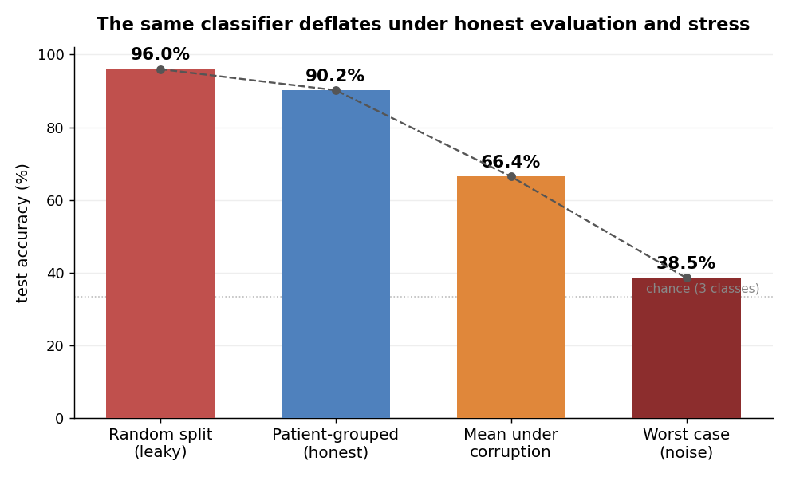

# Auditing a brain-tumour MRI classifier: leakage, robustness, and reliability

[](LICENSE) [](pyproject.toml) [](https://github.com/Parth-KG/neuroscan-ood/actions/workflows/ci.yml) [](https://doi.org/10.5281/zenodo.22009395)

## Abstract

Brain-tumour MRI classifiers on the popular public benchmarks routinely report accuracies in the mid-to-high 90s, including my own earlier project (NeuroScan-AI, 95.39% on a four-class combined dataset with a folder-based split). This repository asks how much of such a number survives an honest evaluation. Using the source Figshare dataset (three tumour types, 3,064 slices from 233 patients) and the SARTAJ dataset, I show that two standard practices inflate accuracy: non-patient-grouped train/test splits (worth about 5.5 points here) and treating Figshare and SARTAJ as independent sources when roughly 85% of their tumour images are duplicates. I then characterise the model's fragility under controlled, ImageNet-C-style corruptions, trace it to an over-reliance on pixel intensity, and show that a label-free adaptation (AdaBN) plus temperature-scaled selective prediction recover most of the lost accuracy and calibration. Every experiment is seeded and reproducible.



*Figure 1. The reported accuracy deflates as evaluation gets more honest and then stressed: from a leaky split (96.0%) to a patient-grouped split (90.2%) to a mean of 66.4% under corruption and 38.5% under noise. Figures are for the Figshare three-class task.*

## Contribution

The techniques used here are standard; the contribution is the audit. Concretely: (1) a reproducible measurement of how much patient-level leakage inflates accuracy on this benchmark, and (2) evidence that the two datasets commonly cross-used for "external validation" of brain-tumour classifiers, Figshare and SARTAJ, are largely the same images, which makes that validation practice invalid. The robustness, diagnosis, and mitigation sections then show the practical consequences and some cheap, label-free remedies.

## Background

My earlier project, [NeuroScan-AI](https://github.com/Parth-KG/NeuroScan-AI), reported 95.39% test accuracy on the [Brain Tumor MRI Dataset](https://www.kaggle.com/datasets/masoudnickparvar/brain-tumor-mri-dataset) by Nickparvar, a four-class (glioma, meningioma, pituitary, no-tumour) combination of Figshare, SARTAJ, and Br35H evaluated with a plain folder-based train/test split. That result motivated this audit. Rather than re-scoring the combined set, I go to its source datasets, where leakage and cross-source duplication can be measured directly, and where the findings explain why folder-split accuracies on the combined dataset (mine, and many published ones) are optimistic.

## Key findings

- **Patient leakage inflates accuracy.** With a random slice-level split, slices from the same patient leak across train and test and accuracy reads **96.0%** (95% CI [95.6, 96.4]). With a patient-grouped split it falls to **90.2%** (95% CI [88.1, 92.3]), a **5.8-point** gap (95% CI [3.9, 7.7]; paired t-test p < 0.001 over 10 seeds). On the risks of this kind of leakage, see Zech et al. (2018) and Kapoor and Narayanan (2023).

  

  *Figure 2. Test accuracy under a random (leaky) split versus a patient-grouped (honest) split, over 10 seeds; bars are means, error bars standard deviation.*

- **The two "independent" datasets are not independent.** A perceptual-hash audit finds **2,335** SARTAJ tumour images within a tiny Hamming distance of a Figshare image, many of them exact duplicates. Any evaluation that trains on one and tests on the other, or mixes them as the combined dataset does, is leaking. (The combined dataset's author himself replaced SARTAJ's glioma images with Figshare images, folding the two together.)

- **The model is fragile under controlled corruptions.** Under an ImageNet-C-style stress test (Hendrycks and Dietterich, 2019) of brightness, contrast, Gaussian noise, blur, downsampling, and an MRI bias field applied to the held-out scans, mean accuracy falls from **89.6%** to about **66%**, and to **38.5%** under noise, while confidence stays high. This is a controlled stress test, not a measured inter-site shift (see Limitations).

  

  *Figure 3. Accuracy of the honest model as each corruption's severity increases (0 = clean); the black line is the mean across corruptions.*

- **The failure is diagnosable.** A linear probe separates clean from corrupted scans almost perfectly in feature space (pooled AUC **0.92**), and Grad-CAM (Selvaraju et al., 2017) shows attention sliding off the tumour. The cause is over-reliance on absolute pixel intensity.

  

  *Figure 4. AUC of a linear probe separating clean from corrupted scans in feature space; near 1.0 means the shift is trivially visible inside the model.*

- **Cheap, label-free fixes recover most of the loss.** Re-estimating BatchNorm statistics on the corrupted scans (AdaBN; Li et al., 2016) lifts accuracy from **79.0%** to **88.9%** and improves calibration, with no labels and no retraining; a training-matched intensity normalisation helps too, while a mismatched one (histogram equalisation) hurts.

  

  *Figure 5. Accuracy under each corruption for the baseline and three label-free mitigations; AdaBN recovers the most.*

- **Uncertainty can be made honest.** Temperature scaling (Guo et al., 2017) cuts calibration error under corruption from **0.154 to 0.044**, and referring the least-confident 20% of scans to a human (selective prediction; Geifman and El-Yaniv, 2017) raises accuracy on the rest from **79.3% to 88.5%**.

  

  *Figure 6. Accuracy versus coverage when the least-confident scans are referred to a human; referring 20% raises accuracy on the rest to 88.5%.*

Full numbers are in [RESULTS.md](RESULTS.md); the method is in [docs/METHODS.md](docs/METHODS.md).

## Data

I use the [Figshare brain-tumour dataset by Jun Cheng](https://figshare.com/articles/dataset/brain_tumor_dataset/1512427) (3,064 T1-weighted contrast-enhanced slices from 233 patients, DOI 10.6084/m9.figshare.1512427). The [SARTAJ Kaggle dataset](https://www.kaggle.com/datasets/sartajbhuvaji/brain-tumor-classification-mri) is used only for the independence audit. Neither dataset is redistributed here; see the setup section for where to place the files. Labels use the canonical encoding meningioma = 0, glioma = 1, pituitary = 2.

## Repository layout

```
src/neuroscan_ood/     the package: data, models, training, evaluation, experiments
scripts/               command-line entry points (prepare, train, evaluate, run_r1..r5, audit)
configs/               run configurations (YAML)
tests/                 unit tests for the deterministic invariants
results/               my result figures and tables
```

## Setup

Requires Python 3.10+ and a GPU for training. Install PyTorch for your platform first (on Colab/Kaggle it is preinstalled), then:

```
pip install -r requirements.txt
pip install -e .
export NEUROSCAN_ROOT=/path/to/a/working/folder
```

Place the raw data under the working folder:

```
$NEUROSCAN_ROOT/data/raw/figshare/*.mat
$NEUROSCAN_ROOT/data/raw/sartaj/{Training,Testing}/<class>/*.jpg   # only needed for the audit
```

## Reproducing the experiments

First fetch the data (Figshare downloads automatically; SARTAJ needs a Kaggle account):

```
python scripts/download_data.py --out-root $NEUROSCAN_ROOT/data/raw
```

Then prepare and run the experiments:

```
python scripts/prepare_data.py --raw-root $NEUROSCAN_ROOT/data/raw --out-root $NEUROSCAN_ROOT/data/prepared
python scripts/run_r1.py       --config configs/r1.yaml --seeds 0 1 2   # leakage
python scripts/audit_sources.py --config configs/audit.yaml             # dataset independence
python scripts/run_r2.py       --config configs/r1.yaml                 # corruptions
python scripts/run_r3.py       --config configs/r1.yaml                 # diagnosis
python scripts/run_r4.py       --config configs/r1.yaml --severity 3    # mitigations
python scripts/run_r5.py       --config configs/r1.yaml --severity 3    # uncertainty
```

Runs are reproducible: seeds are fixed, so re-running a configuration reproduces the metrics exactly on CPU and gives near-identical results on GPU; the numbers in this repo were produced with the released code. `pytest` covers the core invariants (grouped splits share no patient, the manifest counts are correct, the metrics and corruptions are deterministic, and AdaBN changes only the batch-norm statistics).

## Limitations

The corruption study is a controlled, synthetic stress test, chosen precisely because it cannot be contaminated the way SARTAJ is; it is not a measured shift between real scanners or sites, and a genuinely independent external cohort would strengthen the external-validity claim. This is also a source-dataset audit rather than a re-run of NeuroScan-AI's exact four-class, combined-dataset pipeline: the findings explain the failure modes present in that pipeline rather than re-scoring it. Finally, results are from a single architecture (EfficientNet-B0) over three seeds; the leakage and corruption effects are expected to be general, but the exact magnitudes are model-specific.

## References

- J. Cheng et al. "Enhanced Performance of Brain Tumor Classification via Tumor Region Augmentation and Partition." *PLoS ONE*, 2015. Dataset: Cheng, J. "Brain Tumor Dataset." *figshare*, 2017. doi:10.6084/m9.figshare.1512427.
- M. Nickparvar. "Brain Tumor MRI Dataset." *Kaggle*, 2021. (A combination of Figshare, SARTAJ, and Br35H.)
- S. Bhuvaji et al. "Brain Tumor Classification (MRI)." *Kaggle*, 2020. (SARTAJ.)
- M. Tan and Q. Le. "EfficientNet: Rethinking Model Scaling for Convolutional Neural Networks." *ICML*, 2019.
- Y. Li, N. Wang, J. Shi, J. Liu, and X. Hou. "Revisiting Batch Normalization for Practical Domain Adaptation." *arXiv:1603.04779*, 2016 (*Pattern Recognition*, 2018). (AdaBN.)
- C. Guo, G. Pleiss, Y. Sun, and K. Q. Weinberger. "On Calibration of Modern Neural Networks." *ICML*, 2017. (Temperature scaling.)
- R. R. Selvaraju et al. "Grad-CAM: Visual Explanations from Deep Networks via Gradient-based Localization." *ICCV*, 2017.
- D. Hendrycks and T. Dietterich. "Benchmarking Neural Network Robustness to Common Corruptions and Perturbations." *ICLR*, 2019.
- Y. Geifman and R. El-Yaniv. "Selective Classification for Deep Neural Networks." *NeurIPS*, 2017.
- J. R. Zech et al. "Variable generalization performance of a deep learning model to detect pneumonia in chest radiographs: a cross-sectional study." *PLoS Medicine*, 2018.
- S. Kapoor and A. Narayanan. "Leakage and the Reproducibility Crisis in Machine-Learning-based Science." *Patterns*, 2023.

## Citation

If you refer to this work, please cite it (see `CITATION.cff`, or use GitHub's "Cite this repository" button):

> Goswami, P. K. (2026). *Auditing a brain-tumour MRI classifier: leakage, robustness, and reliability.* Zenodo. https://doi.org/10.5281/zenodo.22009395

## Contact

Parth Krishan Goswami — GitHub [@Parth-KG](https://github.com/Parth-KG) — email: [parthkrishangoswami@gmail.com](mailto:parthkrishangoswami@gmail.com)

## License

MIT, see [LICENSE](LICENSE).
