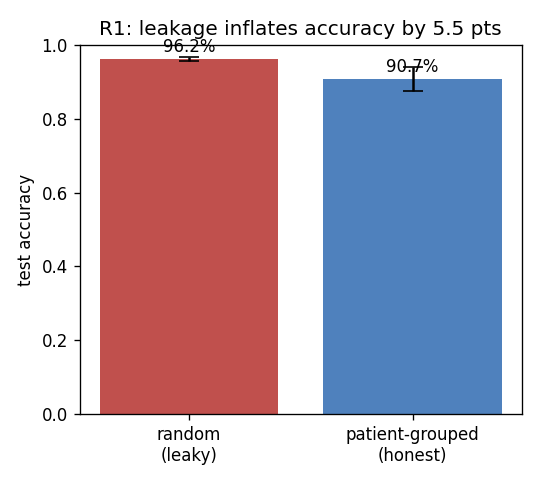
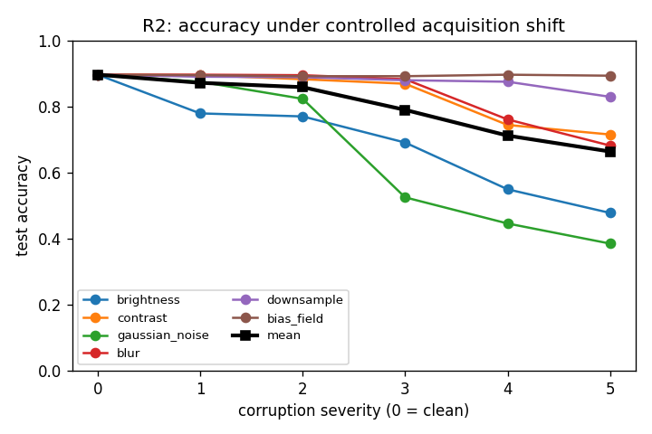
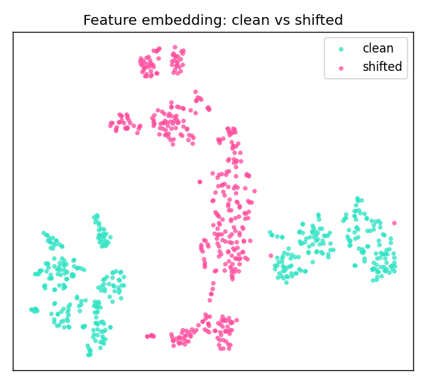
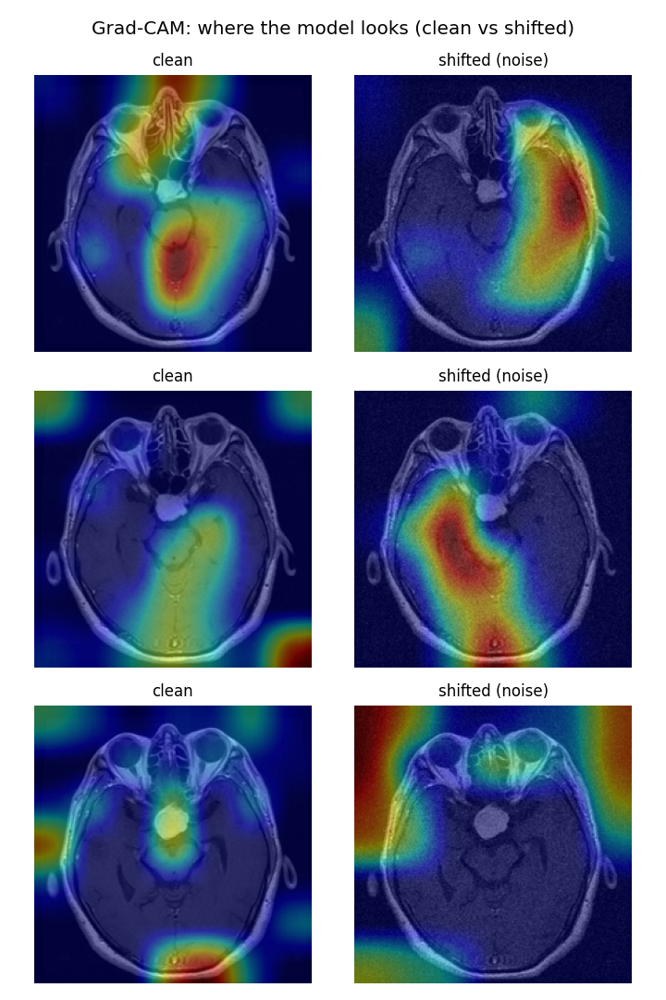
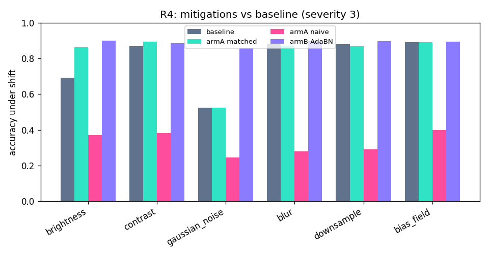
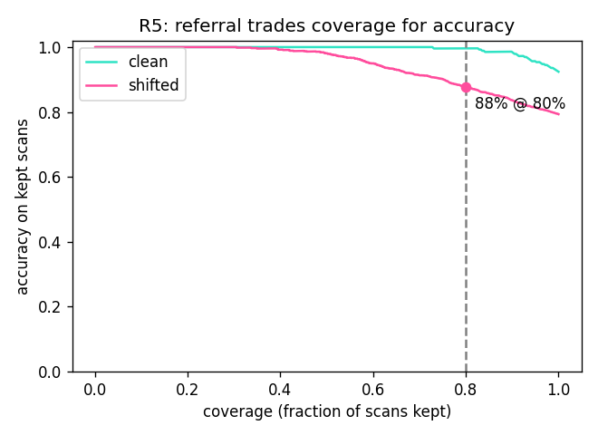

# Results

All numbers below come from the runs in `results/`. Accuracy is on held-out patients (grouped
split, seed 0 unless noted).

## R1 — Patient-level leakage

| Split | Test accuracy |
|---|---|
| Random (leaky) | 96.2% ± 0.5 |
| Patient-grouped (honest) | 90.7% ± 3.2 |

Switching to the honest split costs **5.5 points**, consistently across three seeds. The random
split is very stable (± 0.5) while the honest split varies more (± 3.2), because once patients
cannot leak, the score genuinely depends on which patients land in the test set.

## Audit — Dataset independence

Perceptual-hash comparison of every SARTAJ tumour image against every Figshare image: **2,335**
cross-source pairs fall within a Hamming distance of 5, and the closest distance is **0** (exact
duplicates). Verdict: **FAIL**. The two datasets are largely the same images, so SARTAJ cannot serve
as an independent external test set.

## R2 — Controlled acquisition shift

Accuracy at the strongest severity of each distortion (clean baseline 89.6%):

| Distortion | Accuracy |
|---|---|
| Bias field | 89.3% |
| Downsample | 82.9% |
| Contrast | 71.5% |
| Blur | 68.2% |
| Brightness | 47.8% |
| Gaussian noise | 38.5% |

Mean accuracy across distortions falls to about **66%**, and calibration error climbs sharply under
noise (full curve in `results/tables/r2_shift_results.csv`). The distortions that hurt most all
change raw pixel intensity, pointing to intensity over-reliance.

## R3 — Diagnosis

Domain-classifier AUC (clean vs shifted, in feature space):

| Shift | AUC |
|---|---|
| Brightness / Contrast / Noise | 1.00 |
| Blur | 0.998 |
| Downsample | 0.996 |
| Bias field | 0.738 |
| Pooled | 0.918 |

The shift is almost perfectly visible inside the model, and Grad-CAM shows attention drifting off
the tumour under noise.

## R4 — Mitigations

Mean over the six distortions at severity 3:

| Arm | External accuracy | External ECE | Clean accuracy |
|---|---|---|---|
| Baseline | 79.0% | 0.159 | 89.6% |
| Arm A, matched normalisation | 81.9% | 0.136 | 89.6% |
| Arm A, naive equalisation | 32.8% | 0.539 | 37.4% |
| Arm B, AdaBN | **88.9%** | **0.089** | 90.1% |

AdaBN recovers most of the loss (brightness 69% to 90%, noise 53% to 86%) and improves calibration,
with no labels and no retraining. A training-matched normalisation gives a smaller, safe gain; a
mismatched one hurts badly. Per-distortion numbers are in
`results/tables/r4_mitigation_by_corruption.csv`.

## R5 — Uncertainty

Temperature scaling (temperature fit on clean logits, applied to shifted scans):

| | External ECE |
|---|---|
| Before | 0.154 |
| After | 0.044 |

Referral (referring the least-confident scans to a human): keeping all shifted scans gives **79.3%**
accuracy; keeping the 80% most confident raises it to **88.5%**.

